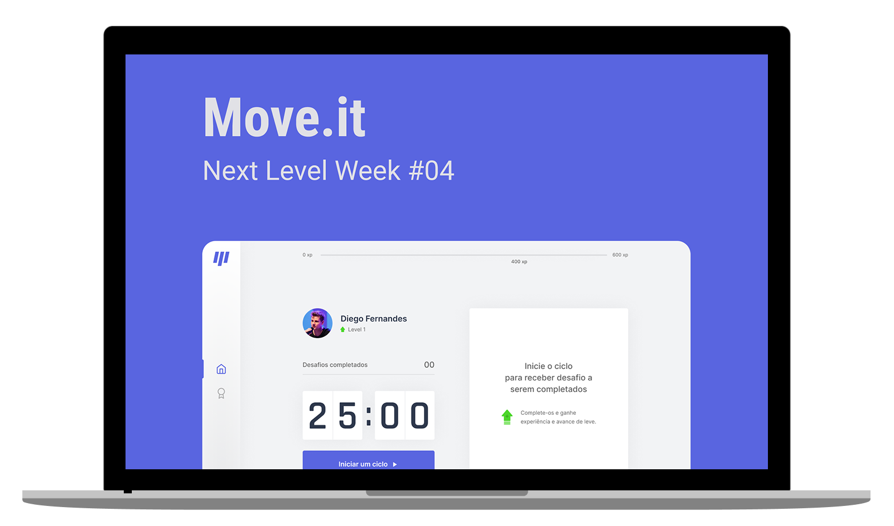
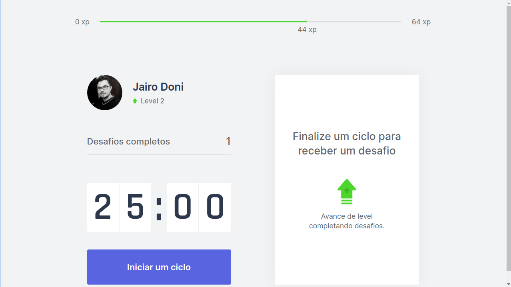
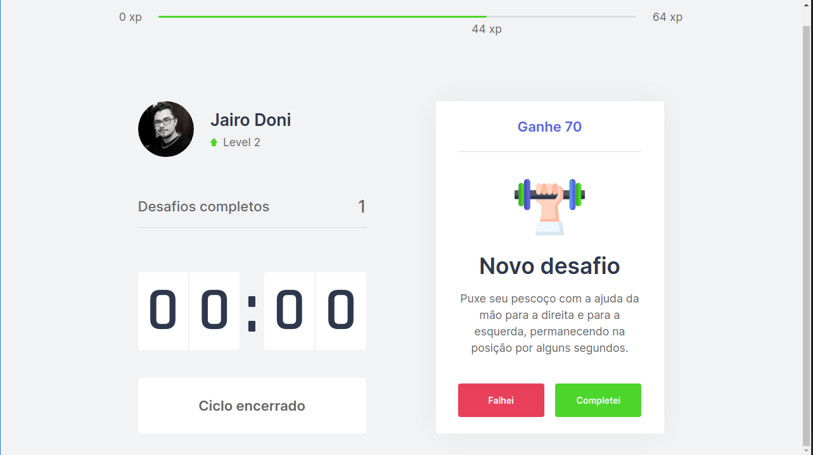
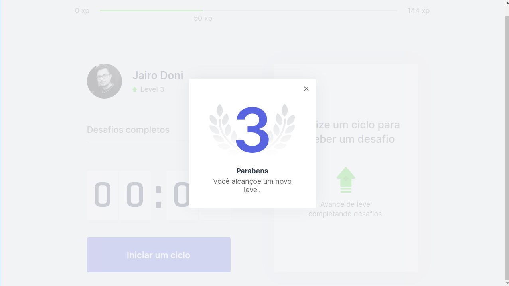

<h1 align="center">
    
</h1>

<div align="center">

![GitHub][repository_license_badge] ![React_Badge][web_react_badge] ![Types][typescript] ![Next][next]
<br>
<p align="center">
  
</p>

</div>

## 💻 Projeto

Um projeto desenvolvido durante o NextLevelWeek04, o projeto "Moveit" tem o intuito de utilizar a tecnica de pomodoro e incentivar as pessoas tirarem um tempo para se alongar durante o trabalho, mantendo a saude e o bens estar do usuario com exercício basicos.

## 🔖 Layout

Você pode visualizar o layout do projeto no formato através [desse link](https://www.figma.com/file/t4WoHGhtu6xlSce2rnzUlz/Move.it-1.0). Lembrando que você irá precisar ter uma conta no [Figma](http://figma.com/).

#### **Web**
<p align="center">
  
</p>
<p align="center">
  
</p>
<p align="center">
  
</p>

## **:computer: TECNOLOGIAS**


#### **Website** ([React][react])
  
  - **[Typescript][typescript]**
  - **[Next.js][next]**
  
\* Veja o arquivo <kbd>[package.json](./package.json)</kbd>

#### **Utilitários**

- Editor: **[Visual Studio Code][vscode]** &rarr; Extensions: **<kbd>[SQLite][vscode_sqlite_extension]</kbd>**
- Markdown: **[StackEdit][stackedit]**, **<kbd>[Markdown Emoji][markdown_emoji]</kbd>**


## **:pushpin: COMO UTILIZAR**

### Configurações Iniciais

Primeiro, você precisa ter o <kbd>[NodeJS](https://nodejs.org/en/download/)</kbd> instalado na sua máquina. 

Se você estiver utilizando o **Linux**, você pode optar por instalar o **Node** através do gerênciador de versões <kbd>[asdf]</kbd> para facilitar o processo de mudança da versão do **Node**, quando for necessário.

Você pode optar também por utilizar o **yarn** no lugar do **npm**. Você pode instalar clicando nesse <kbd>[link][yarn]</kbd>, ou através do <kbd>[asdf]</kbd>.

Após ter o **Node** instalado, instale as dependências do **React** de forma global, utilizando os comandos:

Instale as dependências contidas nos arquivos `package.json` que se encontram na raíz do repositório. Para instalar as dependências, basta abrir o terminal no diretório e digitar o comando:

```sh
$ npm install

# ou
$ yarn
```

> Veja a parte de **scripts {}** do arquivo <kbd>[package.json](./package.json)</kbd> para saber quais scripts estão disponíveis.


### Executando o WebSite

```sh
# Executando o website no modo de desenvolvimento:
$ npm run dev

    OU

# Executando o website no modo de desenvolvimento:
$ yarn dev
```
> Se o browser não abrir automaticamente, acesse: http://localhost:3000.

## **:books: REFERÊNCIAS**

- [Blog Rocketseat](https://blog.rocketseat.com.br/)
- [ReactJS](https://reactjs.org/docs/getting-started.html) | [ReactJS pt-BR](https://pt-br.reactjs.org/docs/getting-started.html)
- [Node](https://nodejs.org/en/)

## :memo: Licença

Esse projeto está sob a licença MIT. Veja o arquivo [LICENSE](LICENSE.md) para mais detalhes.


<!-- Website Links -->

[rocketseat_site]: https://rocketseat.com.br/

<!-- Badges -->

[repository_license_badge]: https://img.shields.io/github/license/JairoDoni/NLW-1.0

[node_version_badge]: https://img.shields.io/badge/node-12.18.0-green

[npm_version_badge]: https://img.shields.io/badge/npm-6.14.4-red

[web_react_badge]: https://img.shields.io/badge/web-react-blue

[typescript]: https://img.shields.io/badge/types-Typescript-blue

[next]: https://img.shields.io/badge/ReactJS-Next.js-lightgrey

[mobile_react-native_badge]: https://img.shields.io/badge/mobile-react%20native-blueviolet

[server_nodejs_badge]: https://img.shields.io/badge/server-nodejs-important

<!-- Techs -->

[react]: https://reactjs.org/

[node]: https://nodejs.org/en/

[vscode]: https://code.visualstudio.com/

[react_native]: http://www.reactnative.com/

[stackedit]: https://stackedit.io

[vscode_sqlite_extension]: https://marketplace.visualstudio.com/items?itemName=alexcvzz.vscode-sqlite

[markdown_emoji]: https://gist.github.com/rxaviers/7360908

[commitlint]: https://github.com/conventional-changelog/commitlint

[feather_icons]: https://feathericons.com/

[next]: https://nextjs.org/

[typescript]: https://www.typescriptlang.org/

[axios]: https://github.com/axios/axios

[dotenv]: https://github.com/motdotla/dotenv

[expo]: https://expo.io/

[expo_google_fonts]: https://github.com/expo/google-fonts

[react_navigation]: https://reactnavigation.org/

[expo_constants]: https://docs.expo.io/versions/latest/sdk/constants/

[supertest]: https://github.com/visionmedia/supertest

[cross_env]: https://github.com/kentcdodds/cross-env

[asdf]: https://github.com/asdf-vm/asdf

[yarn]: https://classic.yarnpkg.com/en/docs/install/#debian-stable
